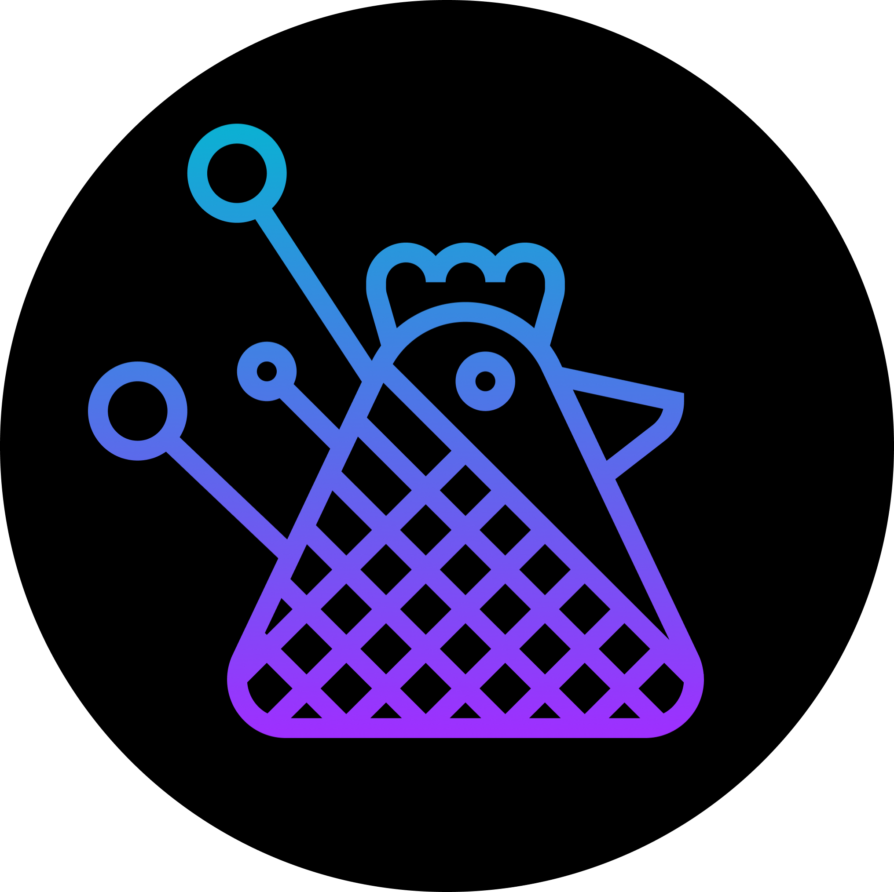

 <h1 align="center">
 
  
 
 
Friendly-Seamstress
</h1>

## Getting started

1. Clone this repo using clone `git https://github.com/JamilsonMello/Friendly-Seamstress.git`
2. Move yourself to the appropriate directory: `cd Friendly-Seamstress` 
3. Run `yarn` to install dependencies 

<h2>Pay attention</h2>

if you want to use this app, add google-services.json from firebase to path android/app/your-file-google-services.json

<h2>Purpose</h2>

this application solves the problem of many micro companies in the clothing sector, many seamstresses have to write down all the information in a notebook and do the math at the end of the month. assists in order management and easily shows how the production is in the month. It is also possible to filter the month data and show the result for that period.

<h2>Some features</h2>

- 
create new companies

- 
create new contributors

- 
create daily production

- 
production list of the month

- 
filter the production of the month and show the result

